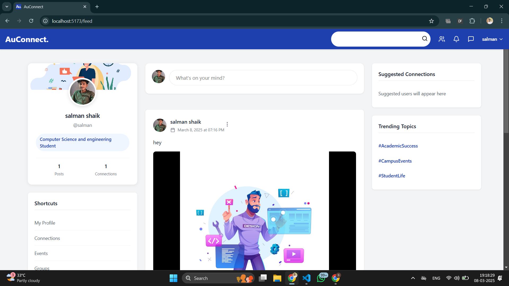
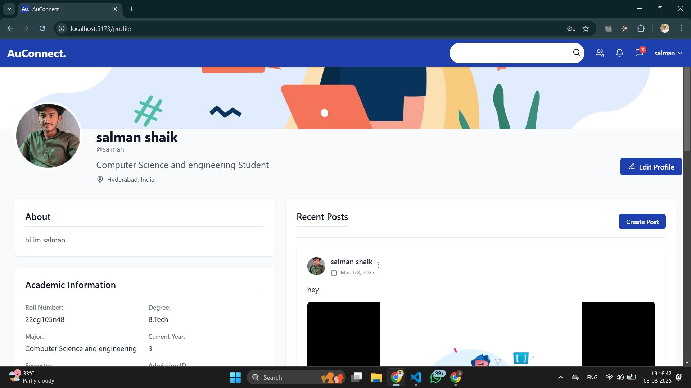
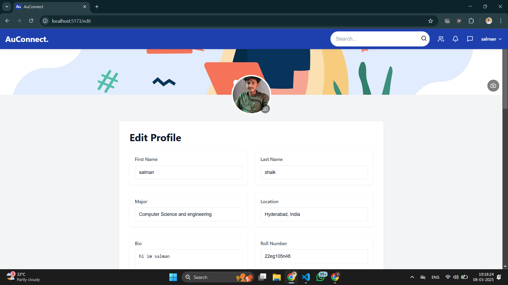
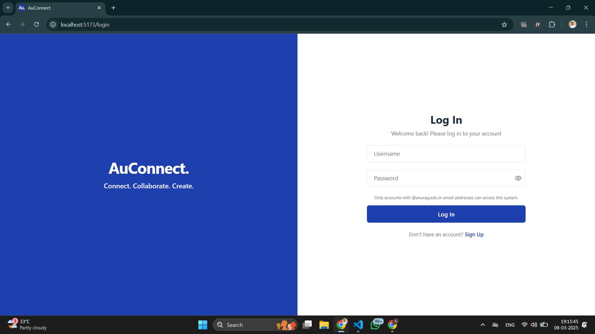

# AuConnect.


## Table of Contents

- [Features](#features)
- [Technologies Used](#technologies-used)
- [Getting Started](#getting-started)
  - [Prerequisites](#prerequisites)
  - [Installation](#installation)
- [Screenshots](#screenshots)
- [Upcoming Features](#upcoming-features)
- [Contributing](#contributing)

---

## Features

- **User Profile Management**: Create and manage personal profiles.
- **Post Creation with Media Support**: Upload images and videos in posts.
- **Commenting and Liking System**: Engage with posts through comments and likes.
- **Messaging Between Users**: Send and receive messages within the platform.
- **User Connections and Networking**: Connect and network with other users.
- **Responsive Design**: Optimized for both desktop and mobile devices.
- **Email Validation**: Enabled OTP verification using GMAIL API

---

## Technologies Used

### **Frontend**
- React
- Vite
- Axios
- Lucide-React
- MUI

### **Backend**
- Spring Boot
- JPA
- MySQL

### **Other**
- Maven

---

## Getting Started

### **Prerequisites**

Ensure you have the following installed:
- **Node.js** (v14 or higher)
- **Java** (v17 or higher)
- **Maven**
- **MySQL**

### **Installation**

#### **1. Clone the repository**

```bash
git clone https://github.com/yourusername/auconnect.git
cd auconnect
```

#### **2. Backend Setup**

- Navigate to the backend directory:

```bash
cd backend
```

- Update the `application.properties` file with your MySQL database credentials:

```properties
spring.datasource.url=jdbc:mysql://localhost:3306/auconnect
spring.datasource.username=root
spring.datasource.password=yourpassword
spring.mail.username=yourEmail
spring.mail.password=AppPassword(For Gmail)
```

- **Email Domain Validation**

By default, the application restricts registration to email addresses ending with `@anurag.edu.in`. If you need to change this to match your university or college email domain, update the email validation logic in `Register.jsx`:

```javascript
// Filepath: Register.jsx
const validate = () => {
  const newErrors = {};

  if (!formData.email.trim()) {
    newErrors.email = 'Email is required';
  } else if (!/\S+@\S+\.\S+/.test(formData.email)) {
    newErrors.email = 'Email is invalid';
  } else if (!formData.email.endsWith('@your-university.edu')) {
    newErrors.email = 'Only university email addresses (@your-university.edu) are allowed';
  }

  // ...existing code...
};
```

Replace `@your-university.edu` with your actual university or college email domain.

- **Build and run the backend:**

```bash
./mvnw clean install
./mvnw spring-boot:run
```

#### **3. Frontend Setup**

- Navigate to the frontend directory:

```bash
cd ../frontend
```

- Install dependencies and start the development server:

```bash
npm install
npm run dev
```

#### **4. Access the application**

- Open your browser and go to: [http://localhost:5173](http://localhost:5173)

---

## Screenshots

### **Home Page**


### **Profile Page**


### **Edit Profile Page**


### **Login Page**


---

## Upcoming Features

- **Event Management**: Create and manage events within the university community.
- **Group Discussions**: Create and join groups for discussions on various topics.
- **Advanced Search**: Enhanced search functionality for users, posts, and groups.
- **Notifications**: Real-time notifications for likes, comments, messages, and more.
- **File Sharing**: Share documents and files within the platform.
- **Mobile App**: Native mobile applications for iOS and Android.

---

## Contributing

Contributions are welcome! Follow these steps to contribute:

1. Fork the repository.
2. Create a new branch with a descriptive name.
3. Make your changes and commit them.
4. Push to your forked repository.
5. Submit a pull request.

We appreciate all contributions to improve AuConnect!

---
